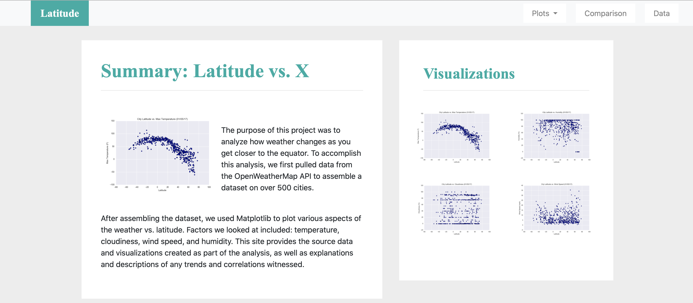

# Web Visualization Dashboard

## Introduction
In this project, a dashboard was create with HTML & CSS to share the analysis out of weather data.

## Data/Tools
* [citipy Python library](https://pypi.python.org/pypi/citipy)
* [OpenWeatherMap API](https://openweathermap.org/api)
* HTML
* CSS

## Copyright

Trilogy Education Services © 2019. All Rights Reserved.
